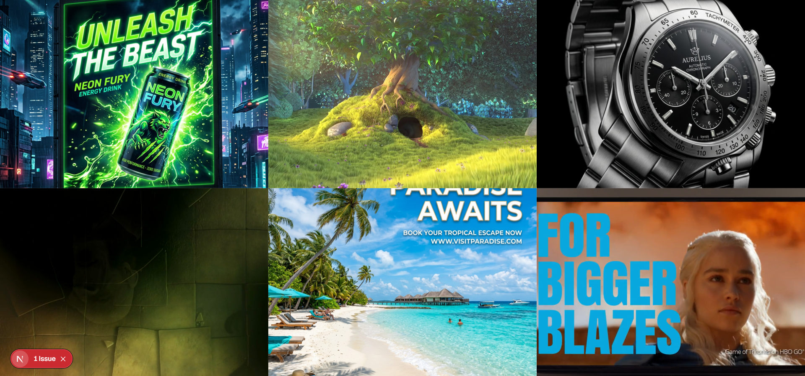

  
  
  
  
  
  
  

# 🧩 AdVista

> **Real-Time Advertisement Billboard Dashboard**

AdVista is a **full-stack web application** designed to **streamline and manage digital billboard displays in real-time**.

The system focuses on **instantaneous updates and seamless user experience** and aims to **provide administrators with a frictionless way to broadcast mixed-media advertisements immediately to spectator screens without page reloads**.

---

# ✨ Key Features

| Feature | Description |
|---|---|
| **Real-time Synchronization** | Powered by Socket.io, frontend billboard grids update immediately when back-office changes occur. |
| **Mixed Media Support** | Seamlessly capable of rendering both static image advertisements and dynamic video clips. |
| **6-Slot Billboard Grid** | Optimized, responsive tile layout holding exactly 6 advertisement slots at a time. |
| **RESTful Administration API** | A robust Express.js backend exposing standard REST endpoints for managing ad creations and deletions. |
| **Decoupled Architecture** | Clear separation between the React/Next.js client and the Node.js server to facilitate independent scaling. |

---

# 🎬 Project Demonstration

The following resources demonstrate the system's behavior:

- [📹 Product Video](#-product-video)
- [📸 Screenshots](#-screenshots)
- [⚙️ Architecture Overview](#️-architecture-overview)
- [🧠 Engineering Lessons](#-engineering-lessons)
- [🔧 Key Design Decisions](#-key-design-decisions)
- [🗺️ Roadmap](#️-roadmap)
- [🚀 Future Improvements](#-future-improvements)
- [📄 Documentations](#-documentations)
- [📝 License](#-license)
- [📩 Contact](#-contact)

If deeper technical access is required, it can be provided upon request.

---

# 📹 Product Video

> **[DEMONSTRATION PENDING]**

*A comprehensive video or GIF of the system's walkthrough demonstrating the Architecture, engines, and core workflows is available soon!*

---

# 📸 Screenshots

  

---

# ⚙️ Architecture Overview

AdVista is implemented using a **decoupled Client-Server Architecture** utilizing a monorepo-style folder layout with dedicated `/frontend` and `/backend` roots.

### Frontend
- **Framework:** Next.js (App Router) & React 19
- **Styling:** Tailwind CSS V4
- **Purpose:** Powers the digital billboard grid, displaying a responsive 6-slot board that auto-updates using client-side WebSocket listeners.

### Backend
- **Server:** Node.js with Express 5.x Runtime
- **Real-Time Communication:** Socket.io
- **Purpose:** Exposes REST APIs via Express to manage ad slots, handles heavy multipart file uploads via `multer`, and broadcasts `NEW_AD_AVAILABLE` events to connected frontends.

### Database Architecture
- **Current Store:** Local **PouchDB** instance as a serverless document store for rapid prototyping.
- **Target Upgrade:** **PostgreSQL**. The NoSQL models will be mapped to a strict relational schema to ensure ACID compliance during multi-tenant scaling.

---

# 🧠 Engineering Lessons & Decisions

During the development of AdVista, the core engineering stack choices and learnings included:

- **1. Next.js Client vs SSR Management:** Balancing the Next.js App Router's SSR capabilities against the strictly Client-Side requirements (`"use client"`) required for WebSocket billboard listeners.
- **2. Express File Routing:** Utilizing a lightweight Node.js/Express server and Multer for direct-to-disk local fast uploading to avoid choking memory during 4K video streams.
- **3. Real-Time Pub-Sub Mechanics:** Implementing push-based architecture via Socket.io over HTTP polling to guarantee immediate content delivery to unattended screens with negligible network overhead.
- **4. Temporary NoSQL Modeling:** Using PouchDB allowed for instant, zero-configuration local prototyping during initial product phases without rigid migrations.
- **5. PostgreSQL Migration Planning:** Architecting the database logic iteratively so the temporary document model (PouchDB) smoothly charts the path toward a relational schema (PostgreSQL) without requiring a complete rewrite of the API routes.

---

# 🔧 Key Design Decisions

1. **The 6-Slot Rigid Grid System**

   Provides a consistent, predictable display model. Restricting the view to 6 slots ensures all active campaigns are perfectly fitted to 1080p/4K hardware without boundless scrolling.

2. **Dark Mode By Default (Black Canvas)**

   Mapped globally to `bg-black`. In physical LED/LCD board installations, deep blacks allow the physical media to act as the sole source of illumination and blends into the monitor bezel.

3. **Browser Media Autoplay Policies**

   Navigating modern browser autoplay restrictions by forcing all video media to load in `muted` mode. This ensures that digital billboards can loop content indefinitely without requiring a human presence or interaction to bypass audio-blocking security protocols.

4. **Atomic Component Structure (`AdSlot`)**

   Treating each `AdSlot` as a highly isolated logic tree so updates to slot #3 do not cause micro-stutters or rerenders on sibling slots during real-time injects.

5. **Modern Typography & Subdued UI**

   Utilizing Next.js optimized fonts (like Geist) to keep the administrative dashboard wrapper premium yet invisible, allowing the ad media to completely dominate the viewer's attention.

---

# 🗺️ Roadmap

Key upcoming features planned for AdVista:

- 🟢 **DONE** — Core Next.js Dashboard Installation & Responsive Grid Layout
- 🟢 **DONE** — Real-time Socket.io Integration & RESTful file upload pipeline
- 🟡 **IN PROGRESS** — Temporary Database Abstraction via Local PouchDB
- 🔴 **NOT STARTED** — Architecture Migration to **PostgreSQL** Database

*(Status Legend: 🟢 Done, 🟡 In Progress, 🔴 Not Started)*

---

# 🚀 Future Improvements

Planned enhancements include:

- Fully normalizing the database schema atop a **PostgreSQL** cluster for transaction safety.
- Introducing a comprehensive Administrative control panel (`/admin`) to visualize play-counts.
- Dockerizing the frontend and backend microservices for automated AWS/GCP deployment.
- Expanding media support for rich HTML5 interactive widget advertisements.
- Creating granular permission systems for advertising agencies versus system administrators.

---

## 📄 Documentations

Additional documentation expanding upon architecture and design is available in the `/docs` folder:

| File | Description |
|---|---|
| [`engineering_decisions.md`](./docs/engineering_decisions.md) | In-depth breakdown of tech stack choices, API routing, and architectural philosophies. |
| [`design_decisions.md`](./docs/design_decisions.md) | Comprehensive overview of the layout logic, UX patterns, and UI state management. |

---

# 📝 License

This repository is published for **portfolio and educational review purposes**.

The source code may not be accessed, copied, modified, distributed, or used without explicit permission from the author.

© 2026 Viraj Tharindu — All Rights Reserved.

---

# 📩 Contact

If you are reviewing this project as part of a hiring process or are interested in the technical approach behind it, feel free to reach out.

I would be happy to discuss the architecture, design decisions, or provide a private walkthrough of the project.

**Opportunities for collaboration or professional roles are always welcome.**

📧 Email: [virajtharindu1997@gmail.com](mailto:virajtharindu1997@gmail.com)  
💼 LinkedIn: [viraj-tharindu](https://www.linkedin.com/in/viraj-tharindu/)  
🌐 Portfolio: [vjstyles.com](https://vjstyles.com)  
🐙 GitHub: [VirajTharindu](https://github.com/VirajTharindu)  

---

  <em>Built with precision, scaled for impact. 🚀✨</em>

